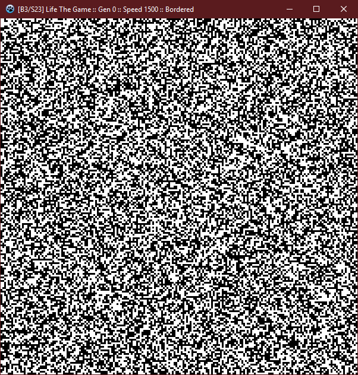
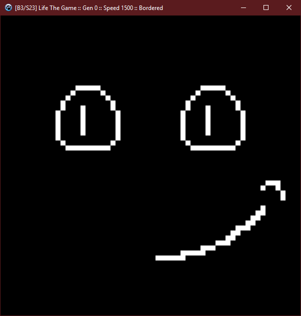

# Game of Life

*from Wikipedia*

The Game of Life, also known simply as Life, is a cellular automaton devised by the British mathematician John Horton Conway.

The game is a zero-player game, meaning that its evolution is determined by its initial state, requiring no further input. One interacts with the Game of Life by creating an initial configuration and observing how it evolves, or, for advanced players, by creating patterns with particular properties.

## Rules

The universe of the Game of Life is an infinite, two-dimensional orthogonal grid of square cells, each of which is in one of two possible states, alive or dead, (or populated and unpopulated, respectively). Every cell interacts with its eight neighbours, which are the cells that are horizontally, vertically, or diagonally adjacent. At each step in time, the following transitions occur:

* Any live cell with fewer than two live neighbours dies, as if by underpopulation.
* Any live cell with two or three live neighbours lives on to the next generation.
* Any live cell with more than three live neighbours dies, as if by overpopulation.
* Any dead cell with exactly three live neighbours becomes a live cell, as if by reproduction.

The initial pattern constitutes the seed of the system. The first generation is created by applying the above rules simultaneously to every cell in the seed; births and deaths occur simultaneously, and the discrete moment at which this happens is sometimes called a tick. Each generation is a pure function of the preceding one. The rules continue to be applied repeatedly to create further generations.

## Features

This desktop application allows you to change game rules at runtime! You can set conditions when cell born or stay, the default setup is Born when 3 around and Stay when 2 or 3 around, otherwise the cell dies. It's possible to change size of the window of the application and of the cells itself. Also, another feature is to disable borders, so cells can interact with cells from opposite side. Enjoy!

## Controls

- Use +/- to increase/decrese render speed
- `LMB` to draw, `RMB` to remove
- `MMB` to render 1 generation by click
- `ESC` to toggle settings
- `ENTER` to toggle loop
- `C` to clear whole field
- `R` to randomize cells on a field
- `CTRL+S` to save your current field
- `CTRL+O` to load field from file

## Screenshots

| Random fill                                        | Drawn smile                                        |
|----------------------------------------------------|----------------------------------------------------|
|  |  |
